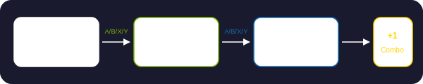
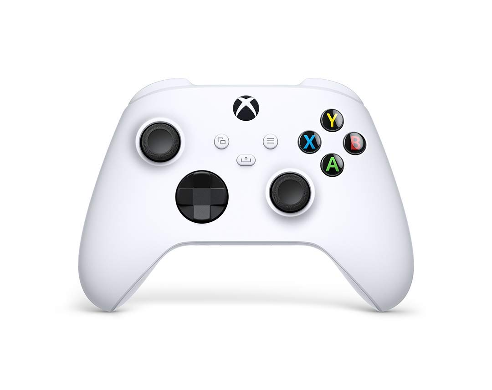
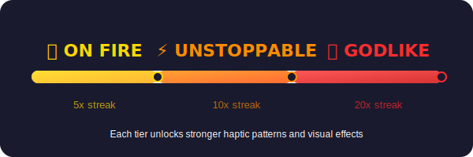

# 🎮 Xbox Controller for Anki (macOS)

[中文](#中文) | [English](#english)

> Turn flashcard review into a game. Built for focus.
>
> 把背卡变成游戏。为专注而生。

---

## 中文

用 Xbox 手柄复习 Anki 卡片。支持连击计数（Combo）、震动反馈（Haptics）和音效，把枯燥的背卡变成游戏体验。

### 为什么做这个？

长时间背卡容易走神，尤其对 ADHD 用户来说更是如此。这个插件通过三种方式帮助你保持专注：

- **🔥 连击系统** — 连续答对积累 combo，触发段位提升，给你持续的正反馈循环
- **📳 震动反馈** — 每次操作都有物理触感，让大脑保持在"当下"
- **🎯 游戏化机制** — 段位、里程碑、视觉特效，把"再背 10 张"变成"再打一局"

这不是拍脑袋的设计。研究表明：

- 游戏化教育应用显著改善 ADHD 群体的注意力和学业表现 [\[1\]](#参考文献)
- 注意力可以通过游戏化机制进行训练和提升 [\[2\]](#参考文献)
- 触觉反馈增强学习效果和内容记忆保留 [\[3\]](#参考文献)

### 功能一览

**操作流程：**

<p align="center">
  
</p>

**按键映射：**

<p align="center">
  
</p>

| 手柄按键 | 动作 | 说明 |
|---------|------|------|
| 🟢 A | Again | 不记得，重来 |
| 🔴 B | Hard | 想起来了，但费劲 |
| 🔵 X | Good | 正常想起 |
| 🟡 Y | Easy | 秒出答案 |
| LT 左扳机 | Replay | 重放音频 |
| RT 右扳机 | Undo | 撤回上一步 |

> 卡片正面按任意答题键 → 翻牌；卡片背面按 → 提交答案

**Combo 连击系统：**

<p align="center">
  
</p>

连续答对（B/X/Y）会累积连击。按 A（Again）断连击。

| 连击数 | 段位 | 效果 |
|-------|------|------|
| 5+ | 🔥 ON FIRE | 金色连击数字 + 段位震动 |
| 10+ | ⚡ UNSTOPPABLE | 橙色 + 更强震动 |
| 20+ | 💀 GODLIKE | 红色 + 最强震动 |

每复习 25 张触发里程碑提示（可配置）。

### 系统要求

- macOS（使用 Apple GameController + CoreHaptics 框架）
- Anki 2.1.45+
- Xbox 无线手柄（蓝牙连接）

### 安装

```bash
cd ~/Library/Application\ Support/Anki2/addons21/
git clone https://github.com/mxzs123/anki-xbox-controller-mac.git xbox_controller
```

重启 Anki，插件自动安装依赖。

### 配置

**Tools → Xbox Controller Settings** 或直接编辑 `config.json`：

```json
{
  "button_mapping": {
    "A": "answer_1",
    "B": "answer_2",
    "X": "answer_3",
    "Y": "answer_4",
    "left_trigger": "replay_audio",
    "right_trigger": "undo"
  },
  "sounds": { "enabled": true, "volume": 0.7 },
  "haptics": { "enabled": true, "intensity_scale": 1.0 },
  "combo": {
    "enabled": true,
    "visual_effects": true,
    "milestone_interval": 25,
    "streak_thresholds": [5, 10, 20]
  },
  "poll_interval_ms": 16
}
```

<details>
<summary>所有可用动作</summary>

| 动作名 | 说明 |
|-------|------|
| `answer_1` | Again（重来） |
| `answer_2` | Hard（困难） |
| `answer_3` | Good（良好） |
| `answer_4` | Easy（简单） |
| `replay_audio` | 重放音频 |
| `undo` | 撤回 |
| `show_answer` | 翻牌 |
| `none` | 无操作 |

</details>

### 手柄连接

1. 长按 Xbox 手柄配对按钮
2. Mac **系统设置 → 蓝牙** 连接手柄
3. 启动 Anki，自动检测并提示连接状态

### 同类项目

- [Contanki](https://github.com/roxgib/anki-contanki) — 跨平台 Anki 手柄插件（无 combo/haptics）

### 参考文献

1. Effectiveness of Serious Games as Digital Therapeutics for Enhancing the Abilities of Children With ADHD — *JMIR Serious Games*, 2025 [[链接]](https://games.jmir.org/2025/1/e60937)
2. A serious-gamification blueprint towards a normalized attention — *Brain Informatics*, 2021 [[链接]](https://pmc.ncbi.nlm.nih.gov/articles/PMC8050194/)
3. Touch to Learn: A Review of Haptic Technology's Impact on Skill Acquisition — *Advanced Intelligent Systems*, 2024 [[链接]](https://advanced.onlinelibrary.wiley.com/doi/10.1002/aisy.202300731)

---

## English

Review Anki flashcards with an Xbox controller. Features a combo system, haptic feedback, and sound effects — turning boring flashcard grinding into a game-like experience.

### Why This Exists

Long study sessions kill focus — especially for people with ADHD. This add-on fights that with three mechanisms:

- **🔥 Combo system** — Consecutive correct answers build a streak with tier upgrades, creating a continuous positive feedback loop
- **📳 Haptic feedback** — Every action has a physical sensation, keeping your brain anchored in the present
- **🎯 Gamification** — Tiers, milestones, and visual effects turn "just 10 more cards" into "just one more round"

This is backed by research:

- Gamified educational apps significantly improve attention and academic outcomes in ADHD populations [\[1\]](#references)
- Attention can be trained and improved through gamification mechanics [\[2\]](#references)
- Haptic feedback enhances learning outcomes and content retention [\[3\]](#references)

### Features

**Review flow:**

<p align="center">
  
</p>

**Button mapping:**

<p align="center">
  
</p>

| Button | Action | Description |
|--------|--------|-------------|
| 🟢 A | Again | Didn't remember |
| 🔴 B | Hard | Remembered with effort |
| 🔵 X | Good | Normal recall |
| 🟡 Y | Easy | Instant recall |
| LT | Replay | Replay audio |
| RT | Undo | Undo last action |

> Press any answer button on card front → flips card. Press on card back → submits answer.

**Combo system:**

<p align="center">
  
</p>

Consecutive correct answers (B/X/Y) build your streak. Pressing A (Again) breaks the combo.

| Streak | Tier | Effect |
|--------|------|--------|
| 5+ | 🔥 ON FIRE | Gold combo counter + tier haptics |
| 10+ | ⚡ UNSTOPPABLE | Orange + stronger haptics |
| 20+ | 💀 GODLIKE | Red + strongest haptics |

Milestone notification every 25 cards (configurable).

### Requirements

- macOS (uses Apple GameController + CoreHaptics frameworks)
- Anki 2.1.45+
- Xbox Wireless Controller (Bluetooth)

### Installation

```bash
cd ~/Library/Application\ Support/Anki2/addons21/
git clone https://github.com/mxzs123/anki-xbox-controller-mac.git xbox_controller
```

Restart Anki. Dependencies install automatically.

### Configuration

**Tools → Xbox Controller Settings** or edit `config.json` directly:

```json
{
  "button_mapping": {
    "A": "answer_1",
    "B": "answer_2",
    "X": "answer_3",
    "Y": "answer_4",
    "left_trigger": "replay_audio",
    "right_trigger": "undo"
  },
  "sounds": { "enabled": true, "volume": 0.7 },
  "haptics": { "enabled": true, "intensity_scale": 1.0 },
  "combo": {
    "enabled": true,
    "visual_effects": true,
    "milestone_interval": 25,
    "streak_thresholds": [5, 10, 20]
  },
  "poll_interval_ms": 16
}
```

<details>
<summary>All available actions</summary>

| Action | Description |
|--------|-------------|
| `answer_1` | Again |
| `answer_2` | Hard |
| `answer_3` | Good |
| `answer_4` | Easy |
| `replay_audio` | Replay audio |
| `undo` | Undo |
| `show_answer` | Flip card |
| `none` | No action |

</details>

### Connecting the Controller

1. Hold the pairing button on the Xbox controller
2. Connect via **System Settings → Bluetooth** on Mac
3. Launch Anki — auto-detects and shows connection status

### Similar Projects

- [Contanki](https://github.com/roxgib/anki-contanki) — Cross-platform Anki controller support (no combo/haptics)

### References

1. Effectiveness of Serious Games as Digital Therapeutics for Enhancing the Abilities of Children With ADHD — *JMIR Serious Games*, 2025 [[link]](https://games.jmir.org/2025/1/e60937)
2. A serious-gamification blueprint towards a normalized attention — *Brain Informatics*, 2021 [[link]](https://pmc.ncbi.nlm.nih.gov/articles/PMC8050194/)
3. Touch to Learn: A Review of Haptic Technology's Impact on Skill Acquisition — *Advanced Intelligent Systems*, 2024 [[link]](https://advanced.onlinelibrary.wiley.com/doi/10.1002/aisy.202300731)

## License

MIT
